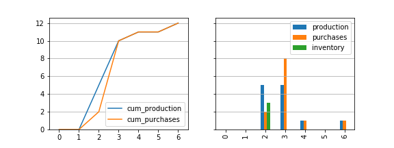

### Task description

- 1 product
- production planning for 7 days
- production quantaties are `x[t], t = 0...6`
- max production capacity C, `0 <= x[t] <= C`, let `C = 5`
- product can be stored for s days, let `s = 3`
- we are given a purchases schedule on each day, let `purchases = [0, 0, 2, 8, 1, 0, 1]`

Find: `x[t]` (can be non-unique)

### Solution

|                    |   0 |   1 |   2 |   3 |   4 |   5 |   6 |
|:-------------------|----:|----:|----:|----:|----:|----:|----:|
| Purchases (given)  |     |     |   2 |   8 |   1 |     |   1 |
| Production (found) |     |     |   5 |   5 |   1 |     |   1 |
| Inventory  (found) |     |     |   3 |     |     |     |     |

Solution code [here](simple_demo.py).

Ideas:

- introduce min phycial inventories as target function 
- may also min time-weights `7*x0 + 6*x1 + ... + 1*x6` 
- several ways to model limited shelf life ("условие непротухания")
- can explcitly model FIFO warehouse (by earmarking daily production), as a check

Hidden assumptions made:

- closed sum - everything produced must be consumed
- no limit on storage capacity
- assume end of day clearance (eg all purchases made at end of day)

### Reference

See <https://coin-or.github.io/pulp/> for PuLP package documentation.
